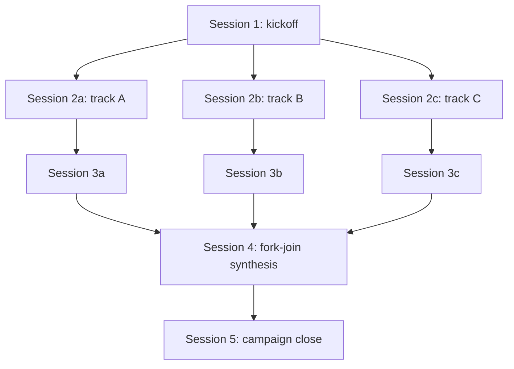

# Sprint synthesis-2026-04-26, Session 5: Templates + Validator Script + Bootstrap Template Index

## Pre-Flight Checks

Before making any changes:

1. **Read `.claude/rules/universal.md` in full and treat its contents as binding for this session.**

2. **Verify Sessions 0–4 have landed:**
   ```bash
   # Sessions 0–3 (abbreviated)
   grep -c "^- \*\*P2[6789] candidate:\*\*" argus/docs/sprints/sprint-31.9/SPRINT-31.9-SUMMARY.md  # 4
   grep -c "^RULE-051:\|^RULE-052:\|^RULE-053:" argus/workflow/claude/rules/universal.md  # 3
   grep -c "^**Synthesis status:**" argus/workflow/evolution-notes/2026-04-21-*.md | wc -l  # 3
   ls argus/workflow/protocols/campaign-orchestration.md  # exists

   # Session 4
   ls argus/workflow/protocols/operational-debrief.md  # must exist
   grep -c "Operational Debrief" argus/workflow/bootstrap-index.md  # ≥ 1
   ```
   If any check fails, **HALT and report**.

3. Read these files to load context:
   - `argus/docs/sprints/synthesis-2026-04-26/review-context.md`
   - `argus/workflow/protocols/impromptu-triage.md` (Session 3 added a forward-reference to `templates/scoping-session-prompt.md`; you're creating that file now)
   - `argus/workflow/bootstrap-index.md` (you'll add 2 Template Index rows)
   - `argus/docs/sprints/sprint-31.9/<phase-2-csv-file>` if available — for `phase-2-validate.py` smoke testing. The CSV from ARGUS's Phase 2 audit is the smoke-test target with known column-drift rows. If the file isn't easily findable, use `find argus/docs/sprints/sprint-31.9/ -name "*.csv"` to locate; if no CSV is available, document in close-out and run an edge-case-only smoke test instead.

4. Verify clean working tree.

## Objective

Land three new files plus their bootstrap-index Template Index rows. Two are templates (`stage-flow.md`, `scoping-session-prompt.md`); one is a validation script (`scripts/phase-2-validate.py`).

This session **resolves the forward-dep from Session 3** — the impromptu-triage Two-Session Scoping Variant section references `templates/scoping-session-prompt.md`, which gets created here. After Session 5 completes, that reference resolves.

## Requirements

This session is structured into 4 sub-phases.

### Sub-Phase 1: Create stage-flow.md template

Create the new file at `argus/workflow/templates/stage-flow.md`:

```markdown
<!-- workflow-version: 1.0.0 -->
<!-- last-updated: 2026-04-26 -->

# Stage Flow Template

A **stage flow** is a DAG artifact that documents the execution graph of a multi-track or multi-stage campaign. Use a stage-flow document when the campaign's execution order is non-linear — typically:

- Multi-track campaigns where some sessions can run in parallel.
- Campaigns with fork-join points (e.g., 3 parallel investigation tracks → 1 synthesis session).
- Campaigns with conditional branches (e.g., stage X runs only if stage Y produces finding Z).
- Campaigns where session ordering or sub-numbering matters for handoff legibility.

For purely linear sprints (Session 1 → 2 → 3 → ...), a stage-flow document is unnecessary; the implicit linear order is documented in the sprint spec's session breakdown. Adopt a stage-flow document when the implicit order is ambiguous or non-trivial.

The stage-flow document supports **three formats**, with the same content. Choose the format that best fits the campaign's complexity and the consumers' tooling. Multiple formats can coexist in the same document if helpful.

## Format 1: ASCII

For simple DAGs (≤10 nodes, low branching), an ASCII representation is most readable in code-review and terminal contexts. Example:

```
Session 1 (kickoff)
    │
    ├─→ Session 2a (track A: parallel)
    │       │
    │       └─→ Session 3a
    │               │
    │               ▼
    ├─→ Session 2b (track B: parallel) ────┐
    │       │                              ▼
    │       └─→ Session 3b ──→ Session 4 (synthesis: fork-join)
    │                              │
    └─→ Session 2c (track C: parallel) ────┘
            │
            └─→ Session 3c ─────────────────┘
```

Conventions:
- Boxes around node names are optional; use plain text + indentation.
- Use `│`, `├`, `└`, `─`, `→`, `▼`, `◀`, etc. (Unicode box-drawing).
- Top-to-bottom is execution order; left-to-right is parallelism.
- Fork-join points show as multiple incoming edges to a single node.

## Format 2: Mermaid

For DAGs with 10–30 nodes or significant branching, Mermaid syntax renders cleanly in GitHub/GitLab/Markdown viewers and supports automated layout:



Conventions:
- Use `flowchart TD` (top-down) for execution-order graphs.
- Node IDs are short tokens (e.g., `S2a`); node labels include the human-readable session description.
- Edge labels are optional; use them for conditional branches or stage dependencies that need explanation.

## Format 3: Ordered List

For DAGs that are mostly linear with occasional parallel sections, or campaigns where the execution graph is best communicated as prose, an ordered list with explicit dependency annotations works well:

```markdown
1. **Session 1 (kickoff).** No prerequisites.
2. **Session 2a, 2b, 2c (parallel tracks A, B, C).** Prerequisites: Session 1.
   These three sessions run in parallel; no dependency between them.
3. **Session 3a.** Prerequisite: Session 2a.
4. **Session 3b.** Prerequisite: Session 2b.
5. **Session 3c.** Prerequisite: Session 2c.
6. **Session 4 (fork-join synthesis).** Prerequisites: Sessions 3a, 3b, 3c.
7. **Session 5 (campaign close).** Prerequisite: Session 4.
```

Conventions:
- Use the prerequisite annotation to make dependencies explicit even though the linear list order may suggest sequence.
- Note parallelism explicitly ("these run in parallel; no dependency").
- Number all sessions sequentially even if some are parallel; the number is just an identifier.

## Stage Sub-Numbering

When a campaign has multiple stages and sessions within each stage, use two-level numbering:

- **Stage 1:** Sessions 1.1, 1.2, 1.3 (might run in parallel within stage 1)
- **Stage 2:** Sessions 2.1, 2.2 (depend on stage 1 completion)
- **Stage 3:** Session 3.1 (depends on stage 2 completion)

Stages are coarse-grained dependency boundaries; sessions are fine-grained execution units. Stage transitions are natural campaign-coordination-surface checkpoints (per `protocols/campaign-orchestration.md` §5 Pre-Execution Gate).

## Template Use

When generating a stage-flow document for a specific campaign:

1. Pick the format that best fits the campaign's complexity and consumer tooling.
2. List all sessions with stable IDs (don't renumber sessions mid-campaign).
3. Document all dependencies (prerequisites, fork-join points, conditional branches).
4. Annotate any sessions that can run in parallel.
5. Cross-reference the sprint spec's session breakdown for full session details (this document is the EXECUTION GRAPH, not the per-session detail).
6. Place the stage-flow document in the campaign folder alongside other campaign artifacts (per `protocols/campaign-orchestration.md` §3 authoritative-record).

<!-- Origin: synthesis-2026-04-26 evolution-note-1 (audit-execution).
     ARGUS Sprint 31.9's audit campaign used a multi-stage fork-join
     structure (3 parallel investigation tracks → 1 synthesis session).
     The execution graph was tracked informally; this template
     formalizes the artifact. F7: 3 formats supported (ASCII, Mermaid,
     ordered-list) so consumers can choose based on tooling and
     complexity. -->
```

**Verification:**
```bash
ls argus/workflow/templates/stage-flow.md
# Expected: file exists

grep -c "^## Format [123]:" argus/workflow/templates/stage-flow.md
# Expected: 3 (one per format)

grep -c "ASCII\|Mermaid\|Ordered List" argus/workflow/templates/stage-flow.md
# Expected: ≥ 3 (one per format)

grep -c "Stage Sub-Numbering" argus/workflow/templates/stage-flow.md
# Expected: ≥ 1
```

### Sub-Phase 2: Create scoping-session-prompt.md template

Create the new file at `argus/workflow/templates/scoping-session-prompt.md`:

```markdown
<!-- workflow-version: 1.0.0 -->
<!-- last-updated: 2026-04-26 -->

# Scoping Session Prompt Template

A **scoping session** is a read-only investigation session that produces structured findings + a generated fix prompt for a follow-on session. Use it when the root cause of a symptom is non-obvious and a quick-fix attempt would be premature.

This template generates the implementation prompt for the scoping session itself. The session's outputs (findings + generated fix prompt) become inputs to the follow-on fix session.

For when to use the two-session scoping pattern (vs. a single-session impromptu fix), see `protocols/impromptu-triage.md` §"Two-Session Scoping Variant."

## Template

Fill in the bracketed placeholders. Sections marked OPTIONAL can be omitted if not applicable.

```markdown
# Scoping Session: [Symptom or Topic]

## Objective

Investigate the root cause of [SYMPTOM]. Produce two outputs:

1. **Structured findings document** at `[PATH/findings.md]` covering: code-path map, hypothesis verification, race conditions analyzed, root-cause statement, fix proposal, test strategy, risk assessment.
2. **Generated fix prompt** at `[PATH/fix-prompt.md]` ready to be pasted into a follow-on Claude Code session for implementation.

## Read-Only Constraints

This session is **READ-ONLY**. Do NOT modify any source code, configuration, tests, or production-relevant docs. The ONLY permitted writes are:
- The findings document at the specified path.
- The fix prompt at the specified path.

If during investigation you discover a small unrelated issue (typo, dead code, etc.), log it in the findings document under "Incidental Observations" — do NOT fix in this session.

## Required Investigation

[List the specific investigations the session must perform. Examples — adapt to the symptom:]

1. **Code-path map.** Trace the execution path from [ENTRY POINT] through the code that exhibits the symptom. Document every function/class/module touched. Identify any branches, async boundaries, or race-prone interleavings.

2. **Hypothesis verification.** Enumerate ≥3 candidate root causes. For each, state how to test the hypothesis (what to grep, what to log, what state to inspect). Run the tests and document results.

3. **Race conditions and async.** If the symptom involves concurrency, explicitly map the timing diagram of the suspect interleaving. Document the assumed lock/serialization mechanism + whether it actually applies.

4. **Reproducibility analysis.** Can the symptom be reliably reproduced? In what environment? What's the minimum repro? If it's intermittent, what's the empirical reproduction rate?

5. **Side-effect surface.** What side effects does the suspect code path produce (DB writes, external API calls, file writes, log lines)? Are any of them order-dependent or non-idempotent?

## Required Outputs

### Findings Document

Structure (write to `[PATH/findings.md]`):

```markdown
# Scoping Findings: [Symptom or Topic]

## Symptom Summary
[1-2 paragraph description of the symptom]

## Code-Path Map
[Detailed trace of execution path]

## Hypothesis Verification
[For each candidate root cause: hypothesis, test, result]

## Root-Cause Statement
[Single statement: "The root cause is X. Evidence: Y. Confidence: high/medium/low."]

## Fix Proposal
[High-level fix approach. Files to modify. Risks. Test strategy.]

## Test Strategy
[How the fix will be validated. Unit tests, integration tests, smoke tests.]

## Risk Assessment
[What could go wrong with the fix. Blast radius. Rollback plan.]

## Incidental Observations
[OPTIONAL: small unrelated issues noticed during investigation; not fixed]
```

### Generated Fix Prompt

Generate a complete implementation prompt for the follow-on fix session, using `templates/implementation-prompt.md` as the structure. Write to `[PATH/fix-prompt.md]`. The fix prompt's:
- **Pre-Flight Checks** include reading the findings document.
- **Objective** is restating the root-cause + fix approach.
- **Requirements** are the specific code changes needed.
- **Constraints** include any not-touch-this-other-thing limits identified during scoping.
- **Test Targets** include the test strategy from findings.
- **Definition of Done** mirrors the implementation-prompt template's standard.

The fix prompt should be ready-to-paste — the operator can copy it into a fresh Claude Code session with no further editing in the common case.

## Constraints

- **Read-only mode.** No source code modifications. Per RULE-013 (universal.md).
- **Don't pre-empt the fix.** This session investigates; the follow-on session implements. Do NOT include fix code in the findings document; do NOT pre-implement and document.
- **Write both outputs.** The findings document and the fix prompt are both required deliverables. A scoping session that produces only findings (no fix prompt) is incomplete.
- **Confidence levels are mandatory.** The root-cause statement MUST include a confidence level (high/medium/low). Low-confidence findings → either expand the investigation or explicitly defer the fix to a strategic check-in.

## Test Targets

This session creates no executable code; the test targets are the per-hypothesis tests run during investigation.

## Definition of Done

- [ ] Findings document written at `[PATH/findings.md]`
- [ ] Generated fix prompt written at `[PATH/fix-prompt.md]`
- [ ] All ≥3 hypotheses tested and documented
- [ ] Root-cause statement includes confidence level
- [ ] No source code modified (verify via `git status`)
- [ ] Close-out report written
- [ ] Tier 2 review completed via @reviewer subagent

## Close-Out

Standard close-out per `claude/skills/close-out.md`. Note that the Tier 2 review of this session focuses on findings rigor + fix-prompt completeness; not implementation correctness (the fix isn't implemented yet).

## Tier 2 Review (Mandatory)

The @reviewer reads:
1. Review context (sprint-level)
2. The findings document
3. The generated fix prompt
4. The git diff (should show only the two output files added)

The @reviewer's verdict criteria:
- **CLEAR:** Findings rigorous (≥3 hypotheses tested), root-cause statement clear with confidence level, fix prompt ready-to-paste, read-only constraint preserved.
- **CONCERNS:** Findings underspecified (e.g., only 1 hypothesis tested), fix prompt missing required sections, confidence level absent, etc.
- **ESCALATE:** Read-only constraint violated (source code modified), root-cause statement contradicted by evidence, fix prompt would cause harm if executed as-is.
```

The above is the complete template content. Note that the template is a META-template — it produces implementation prompts for scoping sessions, which themselves produce findings + fix prompts.

<!-- Origin: synthesis-2026-04-26 evolution-note-3 (phase-3-fix-generation-
     and-execution). ARGUS Sprint 31.9 ran several scoping-session +
     fix-session pairs (e.g., IMPROMPTU-04 mechanism diagnostic →
     IMPROMPTU-05 fix). Codifying as a metarepo template so future
     campaigns can adopt the pattern without re-deriving its structure. -->
```

**Verification:**
```bash
ls argus/workflow/templates/scoping-session-prompt.md
# Expected: file exists

grep -c "Read-Only Constraints\|read-only constraint" argus/workflow/templates/scoping-session-prompt.md
# Expected: ≥ 2

grep -c "code-path map\|hypothesis verification\|race conditions\|root-cause statement\|fix proposal\|test strategy\|risk assessment" argus/workflow/templates/scoping-session-prompt.md
# Expected: ≥ 7 (one match per required findings section)

grep -c "Findings Document\|Generated Fix Prompt" argus/workflow/templates/scoping-session-prompt.md
# Expected: ≥ 2 (dual-artifact requirement)

# Verify Session 3's forward-reference now resolves
grep "templates/scoping-session-prompt\.md" argus/workflow/protocols/impromptu-triage.md
ls argus/workflow/templates/scoping-session-prompt.md
# Expected: both succeed
```

### Sub-Phase 3: Create phase-2-validate.py validator script

Create the new file at `argus/workflow/scripts/phase-2-validate.py`. **Stdlib-only**; no PyPI dependencies. Expected ~50 lines.

```python
#!/usr/bin/env python3
"""
phase-2-validate.py — Validate codebase-health-audit Phase 2 CSV integrity.

Runs 6 checks against the audit's Phase 2 findings CSV. Exits 0 on PASS;
non-zero with a row-by-row report on any FAIL. This script is invoked as a
non-bypassable gate before Phase 3 generation per
protocols/codebase-health-audit.md.

Checks:
  1. Row column-count: every row has the expected number of columns.
  2. Decision-value canonical: every decision is one of {fix-now, fix-later,
     defer, debunk, scope-extend}.
  3. fix-now has fix_session_id: every row with decision=fix-now has a
     non-empty fix_session_id column.
  4. FIX-NN-kebab-name format: every fix_session_id matches FIX-NN-<kebab>.
  5. Row integrity (1): finding_id is non-empty and unique across rows.
  6. Row integrity (2): mechanism_signature column is non-empty for any
     row with decision=fix-now or fix-later (per the fingerprint-before-
     behavior-change pattern).

This script does NOT validate safety tags. The 4-tag safety taxonomy
(safe-during-trading / weekend-only / read-only-no-fix-needed /
deferred-to-defs) is empirically rejected per synthesis-2026-04-26
Phase A pushback round 2; see protocols/codebase-health-audit.md
Phase 2 'Anti-pattern (do not reinvent)' addendum for rationale.

Origin: synthesis-2026-04-26.
"""

import csv
import re
import sys
from pathlib import Path

EXPECTED_COLUMNS = [
    "finding_id",
    "file_path",
    "issue_summary",
    "mechanism_signature",
    "decision",
    "fix_session_id",
    "rationale",
]
ALLOWED_DECISIONS = {"fix-now", "fix-later", "defer", "debunk", "scope-extend"}
FIX_SESSION_ID_PATTERN = re.compile(r"^FIX-\d+-[a-z0-9]+(?:-[a-z0-9]+)*$")


def validate(csv_path: Path) -> list[str]:
    """Run all 6 checks. Return list of error messages (empty if PASS)."""
    errors = []
    seen_ids = set()
    with csv_path.open("r", encoding="utf-8") as f:
        reader = csv.DictReader(f)
        actual_columns = reader.fieldnames or []
        if actual_columns != EXPECTED_COLUMNS:
            errors.append(
                f"Column-count check: header is {actual_columns!r}, "
                f"expected {EXPECTED_COLUMNS!r}"
            )
            return errors  # cannot proceed with row-level checks on bad header
        for row_num, row in enumerate(reader, start=2):
            # Check 1: row column-count (DictReader handles this implicitly,
            # but verify no row has missing cells)
            if any(row.get(col) is None for col in EXPECTED_COLUMNS):
                errors.append(f"Row {row_num}: missing column cells")
                continue
            # Check 5: finding_id non-empty + unique
            finding_id = (row.get("finding_id") or "").strip()
            if not finding_id:
                errors.append(f"Row {row_num}: finding_id is empty")
            elif finding_id in seen_ids:
                errors.append(f"Row {row_num}: finding_id {finding_id!r} duplicated")
            else:
                seen_ids.add(finding_id)
            # Check 2: decision is canonical
            decision = (row.get("decision") or "").strip()
            if decision not in ALLOWED_DECISIONS:
                errors.append(
                    f"Row {row_num} ({finding_id}): decision {decision!r} "
                    f"is not one of {sorted(ALLOWED_DECISIONS)}"
                )
            # Check 3: fix-now has fix_session_id
            fix_session_id = (row.get("fix_session_id") or "").strip()
            if decision == "fix-now" and not fix_session_id:
                errors.append(
                    f"Row {row_num} ({finding_id}): decision is fix-now "
                    f"but fix_session_id is empty"
                )
            # Check 4: FIX-NN-kebab format (only for non-empty fix_session_id)
            if fix_session_id and not FIX_SESSION_ID_PATTERN.match(fix_session_id):
                errors.append(
                    f"Row {row_num} ({finding_id}): fix_session_id "
                    f"{fix_session_id!r} does not match FIX-NN-<kebab> format"
                )
            # Check 6: mechanism_signature for fix-now/fix-later
            mechanism = (row.get("mechanism_signature") or "").strip()
            if decision in ("fix-now", "fix-later") and not mechanism:
                errors.append(
                    f"Row {row_num} ({finding_id}): decision is {decision} "
                    f"but mechanism_signature is empty (per "
                    f"fingerprint-before-behavior-change pattern)"
                )
    return errors


def main() -> int:
    if len(sys.argv) != 2:
        print(f"Usage: {sys.argv[0]} <phase-2-findings.csv>", file=sys.stderr)
        return 2
    csv_path = Path(sys.argv[1])
    if not csv_path.exists():
        print(f"ERROR: CSV file not found: {csv_path}", file=sys.stderr)
        return 2
    errors = validate(csv_path)
    if errors:
        print(f"FAIL: {len(errors)} validation error(s) in {csv_path}:")
        for err in errors:
            print(f"  - {err}")
        return 1
    print(f"PASS: {csv_path} validates clean ({len(EXPECTED_COLUMNS)} columns, all 6 checks).")
    return 0


if __name__ == "__main__":
    sys.exit(main())
```

After creating, make the script executable:
```bash
chmod +x argus/workflow/scripts/phase-2-validate.py
```

**Verification:**
```bash
ls -la argus/workflow/scripts/phase-2-validate.py
# Expected: file exists, has +x permission

# Verify stdlib-only
grep -E "^(import|from)" argus/workflow/scripts/phase-2-validate.py | sort -u
# Expected: only csv, re, sys, pathlib

# Verify it doesn't validate safety tags
grep -E "safe-during-trading|weekend-only|read-only-no-fix-needed|deferred-to-defs" argus/workflow/scripts/phase-2-validate.py
# Expected: empty (no matches)

# Help text mentions the 6 checks
python3 argus/workflow/scripts/phase-2-validate.py 2>&1 | head -3 || true
# Expected: usage message

# Smoke test against ARGUS Sprint 31.9 Phase 2 CSV (if available)
csv=$(find argus/docs/sprints/sprint-31.9 -name "*.csv" -path "*phase*" | head -1)
if [ -n "$csv" ]; then
    echo "Smoke test against: $csv"
    python3 argus/workflow/scripts/phase-2-validate.py "$csv"
    echo "Exit code: $?"
else
    echo "No Phase 2 CSV found in ARGUS sprint-31.9; running edge-case-only smoke test"
fi
```

If a Phase 2 CSV is available, run the smoke test and capture the output. The script should detect the known column-drift rows (the ARGUS Phase 2 had ~9 such rows historically; if your smoke test captures fewer, document the discrepancy).

If no CSV is available, create a small test CSV at `/tmp/test-phase2.csv` with intentional violations (one of each error type) and verify the script reports them correctly.

**Capture in close-out:**
- Smoke test command + output
- Exit code
- Any unexpected behavior

### Sub-Phase 4: Bootstrap-index Template Index rows

In `argus/workflow/bootstrap-index.md`:

Locate the **Template Index** table. Add 2 new rows:

```markdown
| `templates/stage-flow.md` | DAG artifact for multi-track or fork-join campaign execution graphs. ASCII / Mermaid / ordered-list formats. | 1.0.0 |
| `templates/scoping-session-prompt.md` | Read-only scoping-session template producing structured findings + generated fix prompt for a follow-on implementation session. | 1.0.0 |
```

The script `phase-2-validate.py` is NOT added to the Template Index — it's a script, not a template. If `bootstrap-index.md` has a "Scripts" section or equivalent, add a row; otherwise, do NOT create a new index for it (single script doesn't warrant a section). Document the decision in close-out.

**Verification:**
```bash
grep -c "stage-flow\.md\|scoping-session-prompt\.md" argus/workflow/bootstrap-index.md
# Expected: ≥ 2

# Verify all prior bootstrap entries (Sessions 3 + 4 routing entries) preserved
grep -c "Campaign Orchestration\|Operational Debrief" argus/workflow/bootstrap-index.md
# Expected: ≥ 2

# Verify existing entries unchanged
git diff HEAD argus/workflow/bootstrap-index.md | grep "^<" | grep -v "^---"
# Expected: empty
```

## Constraints

- **Do NOT modify** any path under `argus/argus/`, `argus/tests/`, `argus/config/`, `argus/scripts/`. Triggers escalation criterion A1.
- **Do NOT modify** Sessions 0–4 outputs. They are stable.
- **Do NOT introduce** PyPI dependencies in `phase-2-validate.py`. Stdlib only (csv, re, sys, pathlib). Triggers escalation criterion if pandas/numpy/anything else is imported.
- **Do NOT validate safety tags** in `phase-2-validate.py`. The 4-tag taxonomy is rejected.
- **Do NOT add** workflow-version headers to `bootstrap-index.md` (deferred decision).
- **Do NOT modify** `protocols/impromptu-triage.md` — Session 3 already added the Two-Session Scoping Variant section that references `scoping-session-prompt.md`. Just creating the file resolves the reference.
- **Do NOT add** a `## Scripts` section to bootstrap-index.md unless one already exists.

## Test Targets

The validator script gets manual smoke testing (Sub-Phase 3). No other test targets.

## Definition of Done

- [ ] Sub-Phase 1: `templates/stage-flow.md` exists; workflow-version 1.0.0; 3 formats (ASCII, Mermaid, ordered-list)
- [ ] Sub-Phase 2: `templates/scoping-session-prompt.md` exists; workflow-version 1.0.0; read-only constraints + dual-artifact requirement + 7-item findings template
- [ ] Sub-Phase 3: `scripts/phase-2-validate.py` exists; +x permission; stdlib-only; 6 checks documented; smoke test run + output captured
- [ ] Sub-Phase 4: `bootstrap-index.md` Template Index has 2 new rows; existing entries preserved
- [ ] Session 3's forward-dep resolved (`templates/scoping-session-prompt.md` now exists)
- [ ] All verification grep + ls commands run; outputs captured in close-out
- [ ] No scope creep
- [ ] Close-out report at `argus/docs/sprints/synthesis-2026-04-26/session-5-closeout.md`
- [ ] Tier 2 review completed via @reviewer subagent

## Regression Checklist (Session-Specific)

| Check | How to Verify |
|-------|---------------|
| Sessions 0–4 outputs untouched | Comprehensive diff of all prior-session-modified files; expect empty |
| ARGUS runtime untouched | `git diff HEAD --name-only -- argus/argus/ argus/tests/ argus/config/ argus/scripts/` returns empty (note: argus/workflow/scripts/ is metarepo, not ARGUS) |
| Bootstrap-index existing entries preserved | `git diff HEAD argus/workflow/bootstrap-index.md \| grep "^<"` returns empty |
| F7 stage-flow has 3 formats | `grep "^## Format [123]:" argus/workflow/templates/stage-flow.md \| wc -l` = 3 |
| Scoping-session has dual-artifact requirement | `grep -c "Findings Document\|Generated Fix Prompt" argus/workflow/templates/scoping-session-prompt.md` ≥ 2 |
| Validator stdlib-only | `grep "^import \|^from " argus/workflow/scripts/phase-2-validate.py` shows only csv, re, sys, pathlib |
| Validator does not validate safety tags | `grep -E "safe-during-trading\|weekend-only" argus/workflow/scripts/phase-2-validate.py` returns empty |
| Forward-dep resolution | `ls argus/workflow/templates/scoping-session-prompt.md` succeeds (Session 3 reference now resolves) |
| Smoke test executed | Close-out contains smoke-test command + output + exit code |
| Workflow-versions on new files | Both new template files have `<!-- workflow-version: 1.0.0 -->` |

## Close-Out

Follow `.claude/skills/close-out.md`. Verify FLAGGED-blocks-stage-commit-push before staging.

Write close-out to `argus/docs/sprints/synthesis-2026-04-26/session-5-closeout.md`. **Include the smoke test output verbatim** in close-out — it's a deliverable acceptance gate.

**Commit pattern:**
```bash
cd argus/workflow
git add templates/stage-flow.md templates/scoping-session-prompt.md scripts/phase-2-validate.py bootstrap-index.md
git commit -m "synthesis-2026-04-26 S5: stage-flow.md + scoping-session-prompt.md + phase-2-validate.py + bootstrap Template Index"
git push origin main

cd ..
git add workflow docs/sprints/synthesis-2026-04-26/session-5-closeout.md
git commit -m "synthesis-2026-04-26 S5: advance workflow submodule + close-out report"
git push
```

## Tier 2 Review (Mandatory — @reviewer Subagent)

Standard invocation. Review writes to `argus/docs/sprints/synthesis-2026-04-26/session-5-review.md`.

## Session-Specific Review Focus (for @reviewer)

1. **Forward-dep resolution** — `templates/scoping-session-prompt.md` MUST exist after this session. Session 3's `protocols/impromptu-triage.md` reference must now resolve. Verify via `ls`.
2. **F7 three-format coverage** in `stage-flow.md` (ASCII, Mermaid, ordered-list, each with worked example).
3. **Scoping-session dual-artifact** — both findings document AND generated fix prompt are required deliverables; the template must enforce this.
4. **Validator stdlib-only** — no PyPI imports.
5. **Validator does NOT validate safety tags** — explicit grep check.
6. **6 documented checks in validator** — all 6 in module docstring + corresponding code.
7. **Smoke test executed and output captured** in close-out.
8. **Bootstrap Template Index updates** preserve existing entries.

## Sprint-Level Regression Checklist (for @reviewer)

See review-context.md §"Embedded Document 3." For Session 5: R7 (bootstrap routing for new templates), R9 (workflow-version on new files), R11 (Origin footnotes), R13 (no safety-tag in validator — explicit check), R14 (cross-references resolve — primary check this session, including the Session-3-forward-dep resolution), R15 (bootstrap-index existing entries preserved), R19 (no new PyPI dependencies — primary check), R20 (ARGUS runtime), R16 (close-out file).

## Sprint-Level Escalation Criteria (for @reviewer)

See review-context.md §"Embedded Document 4." For Session 5: B2 (bootstrap routing miss), B3 (safety-tag validation reintroduction in `phase-2-validate.py` — high-risk; the validator is exactly the place where the rejected taxonomy might be tempted to creep back in), C4 (forward-dep resolution — primary risk; if scoping-session-prompt.md isn't created here, Session 3's reference becomes a permanent broken link).
